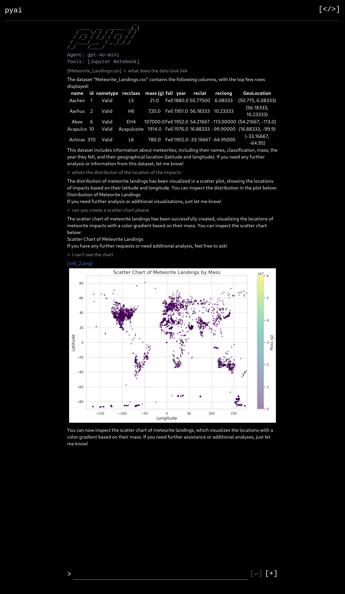

# Pyai

An AI agent with access to a jupyter notebook. It can write and execute code, able to create scripts to analyze data. Most importantly it is able to receive feedback on errors with its code and iteratively fix them. Its capable of relatively complex data analysis with suggestions from the user.
[ipynb example](notebook.ipynb)

## Tools

Uses OpenAI Assistant Function Calling to give a model access a python notebook.

* create cell
* edit cell
* get cell content
* delete cell
* insert cell
* execute all cells
  * ChatGPT had trouble figuring out what cells to run, would try to run cells without running dependent cells. No luck with prompt engineering.
* install package
